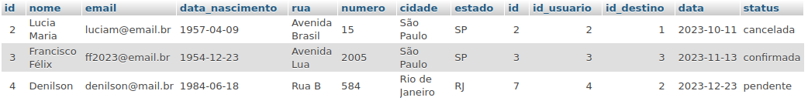
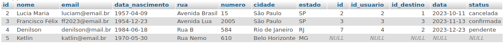
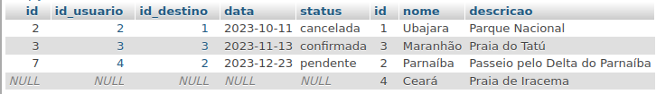

#### Tabela *usuarios*


#### Tabela *destinos*


#### Tabela *reservas*


### INNER JOIN
```
SELECT * FROM usuarios us 
INNER JOIN reservas rs
ON us.id = rs.id_usuario;
``` 



```
SELECT * FROM usuarios us 
INNER JOIN reservas rs ON us.id = rs.id_usuario
INNER JOIN destinos ds ON rs.id_destino = ds.id;
```


### LEFT JOIN
``` 
SELECT * FROM usuarios us 
LEFT JOIN reservas rs
ON us.id = rs.id_usuario;
``` 




### RIGHT JOIN
``` 
SELECT * FROM reservas rs 
RIGHT JOIN destinos ds
ON rs.id_destino = ds.id;
``` 




``` 
